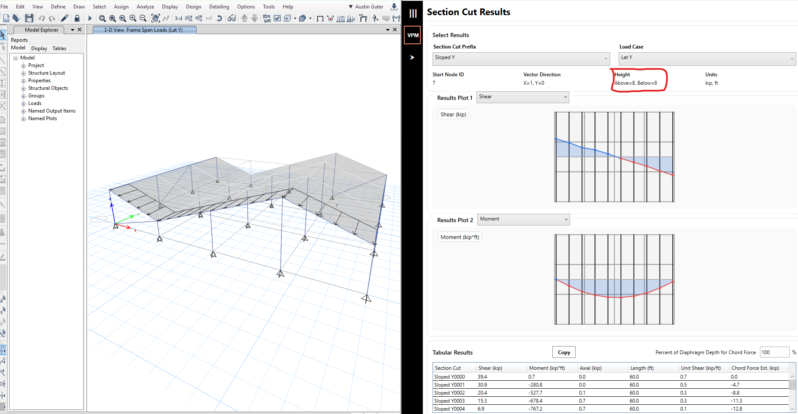

# SectionCutter2

## Overview

SectionCutter2 is an ETABS plugin developed to help structural engineers quickly create section cuts and visually review diaphragm shear, moment, and axial force results in a clear, intuitive, and repeatable way.

Rather than relying solely on tabular output or manually defining section cuts one by one, this tool streamlines the process by combining interactive geometry, automated ETABS section cut creation, and visual result plotting into a single workflow.

The goal is simple:

Understand diaphragm force flow faster and with more confidence.

---

Installation and how to use video:  
https://www.youtube.com/watch?v=h55M_A2X-0I

---

## Example Workflows

### Visual Section Cut Review

### Created Section Cuts

This example demonstrates:
- Selecting diaphragm areas
- Defining section cut spacing
- Automatic section cut generation
- Immediate plotting of diaphragm force results

---

### Review Diaphragm Results

This example demonstrates:
- Adjusting section cut spacing or direction
- Regenerating results
- Rapid visual comparison of force distributions

---
## Why This Tool Exists

Reviewing diaphragm forces in ETABS can be:
- Time-consuming
- Highly iterative
- Difficult to interpret using tables alone
- Error-prone when section cuts must be created manually

SectionCutter2 addresses these issues by allowing engineers to:
- Rapidly define multiple section cuts across a diaphragm
- Instantly see how shear, moment, and axial forces vary spatially
- Validate diaphragm load paths visually
- Iterate on cut locations without repeatedly rebuilding ETABS definitions

This is particularly valuable during:
- Lateral system design
- Diaphragm force checks
- Shear wall load path validation
- Peer review and internal QA/QC
- Design development when layouts are still evolving

---

## High-Level Workflow

1. Select diaphragm areas in ETABS  
2. Define section cut direction and spacing  
3. Automatically generate ETABS section cuts  
4. Extract diaphragm force results  
5. Review results visually using plotted force diagrams  
6. Refine section cuts and re-evaluate as needed  

---

## Application Breakdown

### 1. Area & Opening Selection

The application begins by allowing the user to select:
- Diaphragm area objects
- Openings within the diaphragm (shafts, stairs, large penetrations)

These selections define the **effective diaphragm geometry** used for:
- Section cut extents
- Accurate force extraction
- Avoiding misleading results through voids

---

### 2. Section Cut Definition

Users define:
- Section cut orientation
- Total Number of Section Cuts
- Extents of the cuts across the diaphragm

The tool automatically:
- Extends section cuts slightly beyond the diaphragm geometry to ensure full force capture
- Applies consistent naming and organization inside ETABS
- Prevents duplicate or overlapping section cuts

**Key benefit:** Consistent section cuts can be created in seconds.

---

### 3. ETABS Integration & Result Extraction

Once defined, SectionCutter2:
- Creates section cuts directly in the active ETABS model
- Extracts force results for selected load cases and combinations
- Retrieves shear, moment, and axial values parallel to the cut direction

All interaction with ETABS occurs transparently in the background.

---

### 4. Visual Results Plotting

For each set of section cuts, the application generates:
- Plots of shear, moment, or axial force
- Plots aligned parallel to the diaphragm geometry
- Shaded areas under the curve for intuitive magnitude comparison
- Smooth transitions between adjacent section cuts

This allows engineers to:
- Quickly identify force peaks
- See how forces redistribute across the diaphragm
- Compare different load cases visually
- Catch modeling anomalies early

---

### 5. Results Table & Review

Alongside the plots, the application provides:
- A tabular view of section cut results
- Tablular results can be copied and pasted to excel for own spreadsheet calculations
- Clear correlation between geometry and numeric output

The table and plots are designed to work together — numbers for precision, graphics for understanding.

---

## Installation

Refer to the **installer** folder or the project releases for installation instructions and packaged builds.

---

## Sloping Slabs / Sloped Diaphragms

SectionCutter2 supports sloped diaphragms. When working with sloping slabs, it is important to properly define the **Section Cut Height Above** and **Section Cut Height Below** values so that the full diaphragm thickness and slope are captured by the section cut.

---

### Section Cut Vertical Extents

The vertical span of a section cut is defined relative to the **Start Node elevation**.

The section cut is centered at the Z-elevation of the selected Start Node and extends upward and downward based on the user-defined heights.

For example:

- Start Node elevation = 10 ft  
- Height Above = 4 ft  (always positive)
- Height Below = 4 ft  (always positive)

The section cut vertical limits will be:

- Lower bound = 10 ft − 4 ft = 6 ft  
- Upper bound = 10 ft + 4 ft = 14 ft  

In this example, the section cut spans from **6 ft to 14 ft**.

Both **Height Above** and **Height Below** are positive-only values.

---

### Best Practices for Sloped Diaphragms

When analyzing sloping slabs:

- Ensure the full sloped diaphragm geometry falls within the defined vertical Z range.
- Increase the Height Above and Height Below values as needed to capture the highest and lowest points of the diaphragm along the section cut.
- If the diaphragm falls outside this Z-offset range, forces may not be fully captured.

---

## Notes & Limitations

- Results are dependent on the accuracy of the ETABS model and load definitions.
- Section cuts are intended for diaphragm force review and engineering interpretation.
- The tool is not a substitute for full code-based diaphragm design checks.

---

## License

MIT License

Copyright (c) 2026 Austin Guter, representing Retug LLC

Permission is hereby granted, free of charge, to any person obtaining a copy
of this software and associated documentation files (the "Software"), to deal
in the Software without restriction, including without limitation the rights
to use, copy, modify, merge, publish, distribute, sublicense, and/or sell
copies of the Software, and to permit persons to whom the Software is
furnished to do so, subject to the following conditions:

The above copyright notice and this permission notice shall be included in all
copies or substantial portions of the Software.

THE SOFTWARE IS PROVIDED "AS IS", WITHOUT WARRANTY OF ANY KIND, EXPRESS OR
IMPLIED, INCLUDING BUT NOT LIMITED TO THE WARRANTIES OF MERCHANTABILITY,
FITNESS FOR A PARTICULAR PURPOSE AND NONINFRINGEMENT. IN NO EVENT SHALL THE
AUTHORS OR COPYRIGHT HOLDERS BE LIABLE FOR ANY CLAIM, DAMAGES OR OTHER
LIABILITY, WHETHER IN AN ACTION OF CONTRACT, TORT OR OTHERWISE, ARISING FROM,
OUT OF OR IN CONNECTION WITH THE SOFTWARE OR THE USE OR OTHER DEALINGS IN THE
SOFTWARE.

Third-Party Software Notices
============================

This product includes software developed by third parties.

------------------------------------------------------------
Math.NET Numerics
------------------------------------------------------------
Copyright (c) 2002-2022 Math.NET

Permission is hereby granted, free of charge, to any person obtaining a copy
of this software and associated documentation files (the "Software"), to deal
in the Software without restriction, including without limitation the rights
to use, copy, modify, merge, publish, distribute, sublicense, and/or sell
copies of the Software, and to permit persons to whom the Software is
furnished to do so, subject to the following conditions:

The above copyright notice and this permission notice shall be included in all
copies or substantial portions of the Software.

THE SOFTWARE IS PROVIDED "AS IS", WITHOUT WARRANTY OF ANY KIND, EXPRESS OR
IMPLIED, INCLUDING BUT NOT LIMITED TO THE WARRANTIES OF MERCHANTABILITY,
FITNESS FOR A PARTICULAR PURPOSE AND NONINFRINGEMENT. IN NO EVENT SHALL THE
AUTHORS OR COPYRIGHT HOLDERS BE LIABLE FOR ANY CLAIM, DAMAGES OR OTHER
LIABILITY, WHETHER IN AN ACTION OF CONTRACT, TORT OR OTHERWISE, ARISING FROM,
OUT OF OR IN CONNECTION WITH THE SOFTWARE OR THE USE OR OTHER DEALINGS IN THE
SOFTWARE.

---

