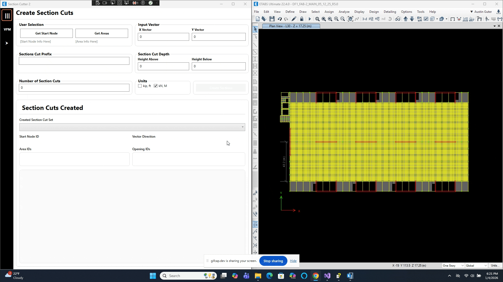
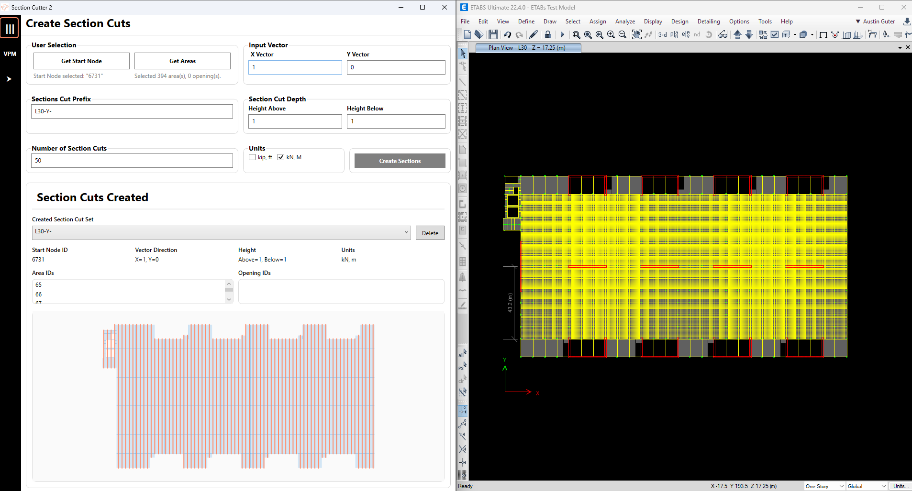
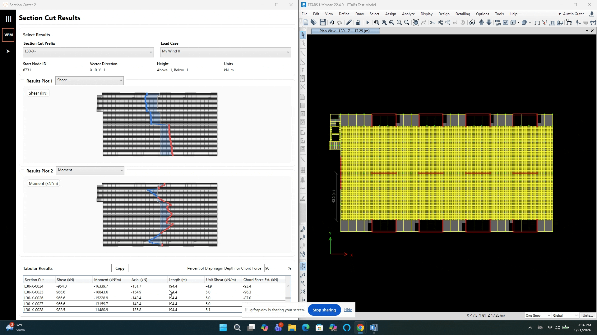

# SectionCutter2 – Visual Diaphragm Results Review for ETABS

## Overview

**SectionCutter2** is an ETABS plugin developed to help structural engineers **quickly create section cuts and visually review diaphragm shear, moment, and axial force results** in a clear, intuitive, and repeatable way.

Rather than relying solely on tabular output or manually defining section cuts one-by-one, this tool streamlines the process by combining **interactive geometry**, **automated ETABS section cut creation**, and **visual result plotting** into a single workflow.

The goal is simple:

> **Understand diaphragm force flow faster and with more confidence.**

---

## Why This Tool Exists

Reviewing diaphragm forces in ETABS can be:
- Time-consuming
- Highly iterative
- Difficult to interpret using tables alone
- Error-prone when section cuts must be created manually

SectionCutter2 addresses these issues by allowing engineers to:
- Rapidly define multiple section cuts across a diaphragm
- Instantly see how shear, moment, and axial forces vary spatially
- Validate diaphragm load paths visually
- Iterate on cut locations without repeatedly rebuilding ETABS definitions

This is particularly valuable during:
- Lateral system design
- Diaphragm force checks
- Shear wall load path validation
- Peer review and internal QA/QC
- Design development when layouts are still evolving

---

## High-Level Workflow

1. Select diaphragm areas in ETABS  
2. Define section cut direction and spacing  
3. Automatically generate ETABS section cuts  
4. Extract diaphragm force results  
5. Review results visually using plotted force diagrams  
6. Refine section cuts and re-evaluate as needed  

---

## Application Breakdown

### 1. Area & Opening Selection

The application begins by allowing the user to select:
- Diaphragm area objects
- Openings within the diaphragm (shafts, stairs, large penetrations)

These selections define the **effective diaphragm geometry** used for:
- Section cut extents
- Accurate force extraction
- Avoiding misleading results through voids

---

### 2. Section Cut Definition

Users define:
- Section cut orientation
- Total Number of Section Cuts
- Extents of the cuts across the diaphragm

The tool automatically:
- Extends section cuts slightly beyond the diaphragm geometry to ensure full force capture
- Applies consistent naming and organization inside ETABS
- Prevents duplicate or overlapping section cuts

**Key benefit:** Consistent section cuts can be created in seconds.

---

### 3. ETABS Integration & Result Extraction

Once defined, SectionCutter2:
- Creates section cuts directly in the active ETABS model
- Extracts force results for selected load cases and combinations
- Retrieves shear, moment, and axial values parallel to the cut direction

All interaction with ETABS occurs transparently in the background.

---

### 4. Visual Results Plotting

For each set of section cuts, the application generates:
- Plots of shear, moment, or axial force
- Plots aligned parallel to the diaphragm geometry
- Shaded areas under the curve for intuitive magnitude comparison
- Smooth transitions between adjacent section cuts

This allows engineers to:
- Quickly identify force peaks
- See how forces redistribute across the diaphragm
- Compare different load cases visually
- Catch modeling anomalies early

---

### 5. Results Table & Review

Alongside the plots, the application provides:
- A tabular view of section cut results
- Tablular results can be copied and pasted to excel for own spreadsheet calculations
- Clear correlation between geometry and numeric output

The table and plots are designed to work together — numbers for precision, graphics for understanding.

---

## Example Workflows

### Visual Section Cut Review

Created Section Cuts

This example demonstrates:
- Selecting diaphragm areas
- Defining section cut spacing
- Automatic section cut generation
- Immediate plotting of diaphragm force results

---

### Iterative Force Path Exploration

This example demonstrates:
- Adjusting section cut spacing or direction
- Regenerating results
- Rapid visual comparison of force distributions

---

## Who This Tool Is For

- Structural engineers working in ETABS
- Engineers designing or reviewing diaphragms
- Engineers who prefer visual confirmation of force flow
- Teams looking to reduce repetitive ETABS setup work
- Anyone reviewing diaphragm forces beyond raw tables

---

## Installation

Refer to the **installer** folder or the project releases for installation instructions and packaged builds.

---

## Notes & Limitations

- Results are dependent on the accuracy of the ETABS model and load definitions.
- Section cuts are intended for diaphragm force review and engineering interpretation.
- The tool is not a substitute for full code-based diaphragm design checks.

---

## License

*(Add license information here if applicable)*

---

